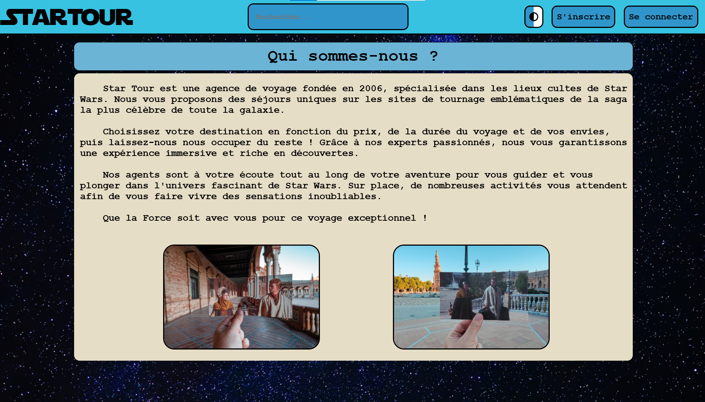

<h1 align="center">🌍 Click-Journey 🌍</h1>



## Introduction

**Click-Journey** est un projet développé en HTML, CSS, PHP et JavaScript pour notre deuxième année du cycle pré-ingénieur. Le projet consiste en la création d’un site web dynamique d’une agence de voyage qui propose des séjours déjà configurés au niveau des étapes. Le nom du site est **Star Tour** et il a pour thème des voyages dans les lieux de tournages cultes de **Star Wars**.

## Prérequis

- Un navigateur moderne (Chrome, Firefox, Edge, etc.) avec JavaScript activé.
- Une version récente de PHP.
- Un serveur web local (WAMP, MAMP, XAMPP pour Windows, ou MAMP pour macOS, ou LAMP pour Linux).


## Installation

### 1. Installer une version récente de PHP :

- **Sous Windows** : Téléchargez et installez **WAMP** (qui inclut PHP et Apache) à partir de [wampserver.com](https://www.wampserver.com/).
- **Sur macOS** : Téléchargez et installez **MAMP** à partir de [mamp.info](https://www.mamp.info/).
- **Sur Linux** : Exécutez les commandes suivantes pour installer PHP 8.3 et les extensions nécessaires :
```sh
  sudo apt update
  sudo apt install software-properties-common
  sudo add-apt-repository ppa:ondrej/php
  sudo apt update
  sudo apt install php8.3
  sudo apt install php8.3-cli php8.3-mbstring php8.3-curl php8.3-xml
```

2. **Cloner le répertoire :** 
```sh
git clone https://github.com/RayyyZen/Click-Journey.git
```

3. **Aller au dossier du projet :** 
```sh
cd Click-Journey
```

4. **Lancer un serveur local :**
- Exemple : 
```sh
php -S localhost:8000
```

5. **Ouvrir la page d'acceuil du site web :**
- Accédez à votre navigateur et entrez l'URL suivante : 
```sh
http://localhost:8000/Pages/index.php
```

## Fonctionnalités

### Couleur

Le site a deux thèmes de couleurs : un bleu et jaune par défaut, et un noir et blanc. L'utilisateur peut passer d'un thème à l'autre en cliquant sur le bouton en haut à droite de la page. Le choix du thème est stocké dans un cookie, ce qui permet de garder le thème sélectionné sur toutes les pages.

### Connexion et inscription

Le site permet de gérer les inscriptions et connexions des utilisateurs grâce aux boutons en haut à droite de la page. En cas d'inscription, l'utilisateur est directement connecté à son compte. Une fois connecté l'utilisateur peut vérifier ses informations et les modifier via la page d'informations à laquelle on peut accéder par un des boutons en haut de la page. Pour réserver un voyage il faut d'abord être connecté sinon l'utilisateur ne peut que visualiser les voyages existants. Les administrateurs quant à eux ont les mêmes privilèges que les utilisateurs, en plus de pouvoir accéder à la page administrateur où il est possible de visualiser et modifier les utilisateurs du site.

### Informations

Lors de la connexion, l'utilisateur peut accéder à une page contenant toutes les informations liées à ce dernier et qu'il a rempli lors de son inscription. On peut aussi y trouver sa date d'inscription, la date de dernière connexion ainsi que les récapitulatifs de ses toutes ses réservations effectuées. L'utilisateur a la possibilité de modifier ses informations sur la même page.

### Destinations

Plusieurs destinations sont proposés par l'agence sur les différents continents. Une barre de recherche permet de trouver un voyage spécifique via son nom sa ville ou son pays. Il y a aussi la possibilité de filtrer la recherche par rapport au prix et à la durée et aussi trier la recherche par rapport à ces derniers. Finalement il suffit de cliquer sur un voyage en étant connecté pour procéder à la réservation de ce dernier.

### Panier

Au moment de réserver un voyage, l'utilisateur a la possibilité de la rajouter à son panier. Dès que le panier contient au moins un élément, une icône en bas à droite de la page apparaît qui permet d'accéder aux voyages du panier. Il y a une possibilité de supprimer des voyages du panier et dès que l'utilisateur est satisfait, il peut procéder au paiement de tous les voyages du panier en même temps. En cas d'échec du paiement, l'utilisateur est renvoyé à la page où se trouve son panier.

## License

Ce projet est sous licence BSD 2-Clause. Consultez le fichier [LICENSE](LICENSE) pour plus de détails.